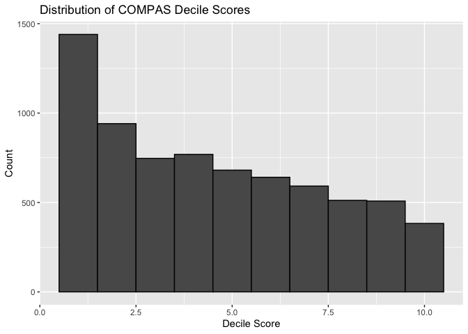
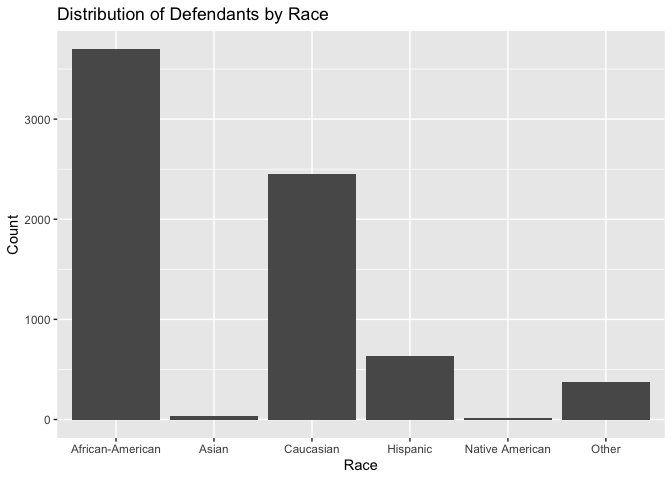
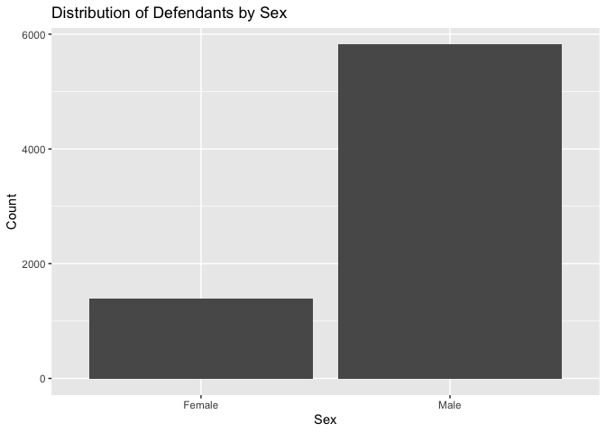
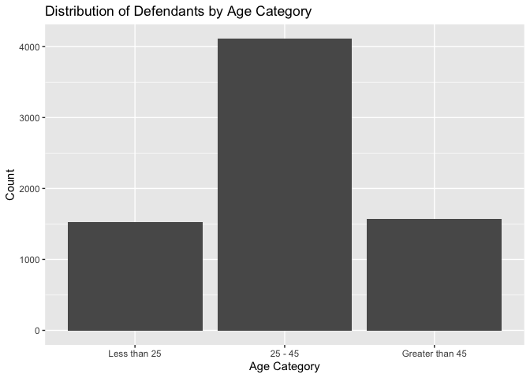
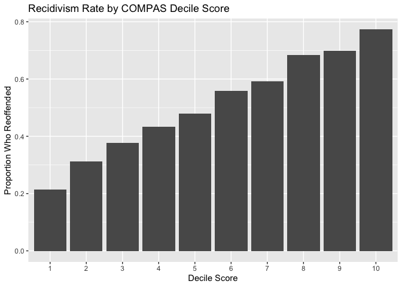
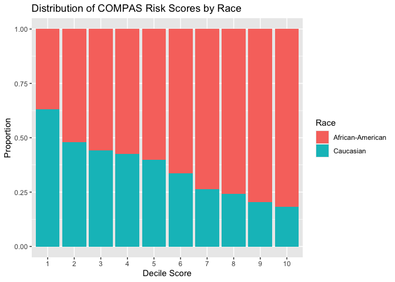
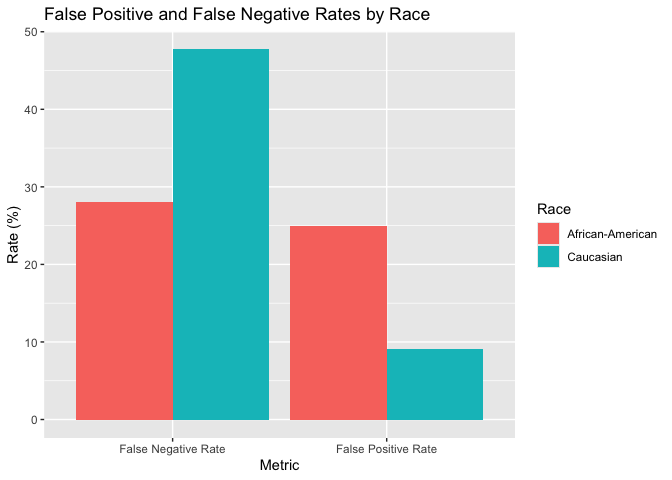
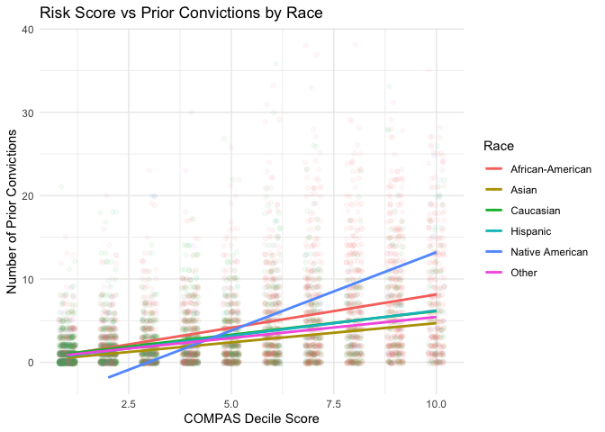
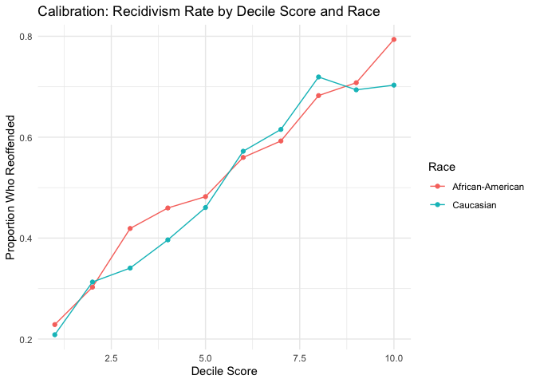

Lab 09: Algorithmic Bias
================
Cynthia Deng
3/2/2026

## Load Packages and Data

First, let’s load the necessary packages:

``` r
library(tidyverse)
library(fairness)
library(janitor)
```

### The data

For this lab, we’ll use the COMPAS dataset compiled by ProPublica. The
data has been preprocessed and cleaned for you. You’ll have to load it
yourself. The dataset is available in the `data` folder, but I’ve
changed the file name from `compas-scores-two-years.csv` to
`compas-scores-2-years.csv`. I’ve done this help you practice debugging
code when you encounter an error.

``` r
compas <- read_csv("data/compas-scores-2-years.csv") %>%
  clean_names() %>%
  rename(
    decile_score = decile_score_12,
    priors_count = priors_count_15
  )
```

    ## New names:
    ## Rows: 7214 Columns: 53
    ## ── Column specification
    ## ──────────────────────────────────────────────────────── Delimiter: "," chr
    ## (19): name, first, last, sex, age_cat, race, c_case_number, c_charge_de... dbl
    ## (19): id, age, juv_fel_count, decile_score...12, juv_misd_count, juv_ot... lgl
    ## (1): violent_recid dttm (2): c_jail_in, c_jail_out date (12):
    ## compas_screening_date, dob, c_offense_date, c_arrest_date, r_offe...
    ## ℹ Use `spec()` to retrieve the full column specification for this data. ℹ
    ## Specify the column types or set `show_col_types = FALSE` to quiet this message.
    ## • `decile_score` -> `decile_score...12`
    ## • `priors_count` -> `priors_count...15`
    ## • `decile_score` -> `decile_score...40`
    ## • `priors_count` -> `priors_count...49`

``` r
# Take a look at the data
glimpse(compas)
```

    ## Rows: 7,214
    ## Columns: 53
    ## $ id                      <dbl> 1, 3, 4, 5, 6, 7, 8, 9, 10, 13, 14, 15, 16, 18…
    ## $ name                    <chr> "miguel hernandez", "kevon dixon", "ed philo",…
    ## $ first                   <chr> "miguel", "kevon", "ed", "marcu", "bouthy", "m…
    ## $ last                    <chr> "hernandez", "dixon", "philo", "brown", "pierr…
    ## $ compas_screening_date   <date> 2013-08-14, 2013-01-27, 2013-04-14, 2013-01-1…
    ## $ sex                     <chr> "Male", "Male", "Male", "Male", "Male", "Male"…
    ## $ dob                     <date> 1947-04-18, 1982-01-22, 1991-05-14, 1993-01-2…
    ## $ age                     <dbl> 69, 34, 24, 23, 43, 44, 41, 43, 39, 21, 27, 23…
    ## $ age_cat                 <chr> "Greater than 45", "25 - 45", "Less than 25", …
    ## $ race                    <chr> "Other", "African-American", "African-American…
    ## $ juv_fel_count           <dbl> 0, 0, 0, 0, 0, 0, 0, 0, 0, 0, 0, 0, 0, 0, 0, 0…
    ## $ decile_score            <dbl> 1, 3, 4, 8, 1, 1, 6, 4, 1, 3, 4, 6, 1, 4, 1, 3…
    ## $ juv_misd_count          <dbl> 0, 0, 0, 1, 0, 0, 0, 0, 0, 0, 0, 0, 0, 0, 0, 0…
    ## $ juv_other_count         <dbl> 0, 0, 1, 0, 0, 0, 0, 0, 0, 0, 0, 0, 0, 0, 0, 0…
    ## $ priors_count            <dbl> 0, 0, 4, 1, 2, 0, 14, 3, 0, 1, 0, 3, 0, 0, 1, …
    ## $ days_b_screening_arrest <dbl> -1, -1, -1, NA, NA, 0, -1, -1, -1, 428, -1, 0,…
    ## $ c_jail_in               <dttm> 2013-08-13 06:03:42, 2013-01-26 03:45:27, 201…
    ## $ c_jail_out              <dttm> 2013-08-14 05:41:20, 2013-02-05 05:36:53, 201…
    ## $ c_case_number           <chr> "13011352CF10A", "13001275CF10A", "13005330CF1…
    ## $ c_offense_date          <date> 2013-08-13, 2013-01-26, 2013-04-13, 2013-01-1…
    ## $ c_arrest_date           <date> NA, NA, NA, NA, 2013-01-09, NA, NA, 2013-08-2…
    ## $ c_days_from_compas      <dbl> 1, 1, 1, 1, 76, 0, 1, 1, 1, 308, 1, 0, 0, 1, 4…
    ## $ c_charge_degree         <chr> "F", "F", "F", "F", "F", "M", "F", "F", "M", "…
    ## $ c_charge_desc           <chr> "Aggravated Assault w/Firearm", "Felony Batter…
    ## $ is_recid                <dbl> 0, 1, 1, 0, 0, 0, 1, 0, 0, 1, 0, 1, 0, 0, 1, 1…
    ## $ r_case_number           <chr> NA, "13009779CF10A", "13011511MM10A", NA, NA, …
    ## $ r_charge_degree         <chr> NA, "(F3)", "(M1)", NA, NA, NA, "(F2)", NA, NA…
    ## $ r_days_from_arrest      <dbl> NA, NA, 0, NA, NA, NA, 0, NA, NA, 0, NA, NA, N…
    ## $ r_offense_date          <date> NA, 2013-07-05, 2013-06-16, NA, NA, NA, 2014-…
    ## $ r_charge_desc           <chr> NA, "Felony Battery (Dom Strang)", "Driving Un…
    ## $ r_jail_in               <date> NA, NA, 2013-06-16, NA, NA, NA, 2014-03-31, N…
    ## $ r_jail_out              <date> NA, NA, 2013-06-16, NA, NA, NA, 2014-04-18, N…
    ## $ violent_recid           <lgl> NA, NA, NA, NA, NA, NA, NA, NA, NA, NA, NA, NA…
    ## $ is_violent_recid        <dbl> 0, 1, 0, 0, 0, 0, 0, 0, 0, 1, 0, 0, 0, 0, 0, 0…
    ## $ vr_case_number          <chr> NA, "13009779CF10A", NA, NA, NA, NA, NA, NA, N…
    ## $ vr_charge_degree        <chr> NA, "(F3)", NA, NA, NA, NA, NA, NA, NA, "(F2)"…
    ## $ vr_offense_date         <date> NA, 2013-07-05, NA, NA, NA, NA, NA, NA, NA, 2…
    ## $ vr_charge_desc          <chr> NA, "Felony Battery (Dom Strang)", NA, NA, NA,…
    ## $ type_of_assessment      <chr> "Risk of Recidivism", "Risk of Recidivism", "R…
    ## $ decile_score_40         <dbl> 1, 3, 4, 8, 1, 1, 6, 4, 1, 3, 4, 6, 1, 4, 1, 3…
    ## $ score_text              <chr> "Low", "Low", "Low", "High", "Low", "Low", "Me…
    ## $ screening_date          <date> 2013-08-14, 2013-01-27, 2013-04-14, 2013-01-1…
    ## $ v_type_of_assessment    <chr> "Risk of Violence", "Risk of Violence", "Risk …
    ## $ v_decile_score          <dbl> 1, 1, 3, 6, 1, 1, 2, 3, 1, 5, 4, 4, 1, 2, 1, 2…
    ## $ v_score_text            <chr> "Low", "Low", "Low", "Medium", "Low", "Low", "…
    ## $ v_screening_date        <date> 2013-08-14, 2013-01-27, 2013-04-14, 2013-01-1…
    ## $ in_custody              <date> 2014-07-07, 2013-01-26, 2013-06-16, NA, NA, 2…
    ## $ out_custody             <date> 2014-07-14, 2013-02-05, 2013-06-16, NA, NA, 2…
    ## $ priors_count_49         <dbl> 0, 0, 4, 1, 2, 0, 14, 3, 0, 1, 0, 3, 0, 0, 1, …
    ## $ start                   <dbl> 0, 9, 0, 0, 0, 1, 5, 0, 2, 0, 0, 4, 1, 0, 0, 0…
    ## $ end                     <dbl> 327, 159, 63, 1174, 1102, 853, 40, 265, 747, 4…
    ## $ event                   <dbl> 0, 1, 0, 0, 0, 0, 1, 0, 0, 1, 0, 1, 0, 0, 1, 1…
    ## $ two_year_recid          <dbl> 0, 1, 1, 0, 0, 0, 1, 0, 0, 1, 0, 1, 0, 0, 1, 1…

## Exercise 1

The dataset has 7214 rows and 53 columns.

## Exercise 2

``` r
n_distinct(compas$id)                 
```

    ## [1] 7214

``` r
n_distinct(compas$name)  
```

    ## [1] 7158

``` r
n_distinct(compas$first)  
```

    ## [1] 2800

``` r
n_distinct(compas$last)  
```

    ## [1] 3950

There are 7,214 rows in the dataset, but only 7,158 unique defendant
IDs. The number of rows exceeds the number of unique defendants. There
could be 2 possible explanations. 1. Some individuals appear more than
once. 2. Some people have the same name.

## Exercise 3

``` r
ggplot(compas, aes(x = decile_score)) +
  geom_histogram(binwidth = 1, color = "black") +
  labs(title = "Distribution of COMPAS Decile Scores",
       x = "Decile Score",
       y = "Count")
```

<!-- -->

``` r
# Race
ggplot(compas, aes(x = race)) +
  geom_bar() +
  labs(title = "Distribution of Defendants by Race", x = "Race", y = "Count")
```

<!-- -->

``` r
# Sex
ggplot(compas, aes(x = sex)) +
  geom_bar() +
  labs(title = "Distribution of Defendants by Sex", x = "Sex", y = "Count")
```

<!-- -->

``` r
# Age Category
ggplot(compas, aes(x = age_cat)) +
  geom_bar() +
  scale_x_discrete(limits = c("Less than 25", "25 - 45", "Greater than 45")) +
  labs(title = "Distribution of Defendants by Age Category", x = "Age Category", y = "Count")
```

<!-- -->

## Exercise 5

``` r
ggplot(compas, aes(x = factor(decile_score), y = two_year_recid)) +
  stat_summary(fun = mean, geom = "bar") +
  labs(title = "Recidivism Rate by COMPAS Decile Score",
       x = "Decile Score",
       y = "Proportion Who Reoffended")
```

<!-- --> Yes, higher
COMPAS risk scores do correspond to higher rates of recidivism. The
chart shows a clear and consistent positive trend

## Exercise 6

``` r
compas <- compas %>%
  mutate(compas_classification = case_when(
    decile_score >= 7 & two_year_recid == 1 ~ "TP",
    decile_score <= 4 & two_year_recid == 0 ~ "TN",
    decile_score >= 7 & two_year_recid == 0 ~ "FP",
    decile_score <= 4 & two_year_recid == 1 ~ "FN",
    TRUE ~ NA_character_  # scores 5-6 are excluded
  )) 
compas %>%
  count(compas_classification) %>%
  mutate(percent = round(n / sum(n) * 100, 1))
```

    ## # A tibble: 5 × 3
    ##   compas_classification     n percent
    ##   <chr>                 <int>   <dbl>
    ## 1 FN                     1216    16.9
    ## 2 FP                      644     8.9
    ## 3 TN                     2681    37.2
    ## 4 TP                     1351    18.7
    ## 5 <NA>                   1322    18.3

## Exercise 7

``` r
compas %>%
  filter(!is.na(compas_classification)) %>%
  summarise(accuracy = mean(compas_classification %in% c("TP", "TN")))
```

    ## # A tibble: 1 × 1
    ##   accuracy
    ##      <dbl>
    ## 1    0.684

Among defendants with a clear low (≤4) or high (≥7) risk score, COMPAS
correctly classified 68.4% of cases, with false negatives (16.9%)
outnumbering false positives (8.9%), suggesting the algorithm is more
likely to underestimate risk than overestimate it.

## Exercise 8

``` r
compas %>%
  filter(race %in% c("African-American", "Caucasian")) %>%
  ggplot(aes(x = factor(decile_score), fill = race)) +
  geom_bar(position = "fill") +
  labs(title = "Distribution of COMPAS Risk Scores by Race",
       x = "Decile Score",
       y = "Proportion",
       fill = "Race")
```

<!-- --> The
distribution of COMPAS risk scores differs notably between Black and
white defendants. At low decile scores (1–2), Caucasian defendants make
up a larger share, with white defendants representing about 35–50% of
those scores. However, as decile scores increase, the proportion of
African-American defendants grows steadily. At scores of 8–10, Black
defendants make up roughly 80% of all defendants at those risk levels.

## Exercise 9

``` r
compas %>%
  filter(race %in% c("African-American", "Caucasian")) %>%
  group_by(race) %>%
  summarise(
    total = n(),
    high_risk = sum(decile_score >= 7),
    percent_high_risk = mean(decile_score >= 7) * 100
  )
```

    ## # A tibble: 2 × 4
    ##   race             total high_risk percent_high_risk
    ##   <chr>            <int>     <int>             <dbl>
    ## 1 African-American  3696      1425              38.6
    ## 2 Caucasian         2454       419              17.1

There is a clear racial disparity in high-risk classifications. 38.6% of
Black defendants were classified as high risk (decile score ≥ 7),
compared to only 17.1% of white defendants

## Exercise 10

``` r
# False Positive Rate by race
fpr <- compas %>%
  filter(race %in% c("African-American", "Caucasian"),
         two_year_recid == 0) %>%
  group_by(race) %>%
  summarise(
    false_positive_rate = mean(decile_score >= 7) * 100
  )

# False Negative Rate by race
fnr <- compas %>%
  filter(race %in% c("African-American", "Caucasian"),
         two_year_recid == 1) %>%
  group_by(race) %>%
  summarise(
    false_negative_rate = mean(decile_score <= 4) * 100
  )

fpr
```

    ## # A tibble: 2 × 2
    ##   race             false_positive_rate
    ##   <chr>                          <dbl>
    ## 1 African-American               24.9 
    ## 2 Caucasian                       9.14

``` r
fnr
```

    ## # A tibble: 2 × 2
    ##   race             false_negative_rate
    ##   <chr>                          <dbl>
    ## 1 African-American                28.0
    ## 2 Caucasian                       47.7

## Exercise 11

``` r
# Calculate both metrics
metrics <- bind_rows(
  compas %>%
    filter(race %in% c("African-American", "Caucasian"), two_year_recid == 0) %>%
    group_by(race) %>%
    summarise(rate = mean(decile_score >= 7) * 100, metric = "False Positive Rate"),
  compas %>%
    filter(race %in% c("African-American", "Caucasian"), two_year_recid == 1) %>%
    group_by(race) %>%
    summarise(rate = mean(decile_score <= 4) * 100, metric = "False Negative Rate")
)

# Visualize
ggplot(metrics, aes(x = metric, y = rate, fill = race)) +
  geom_bar(stat = "identity", position = "dodge") +
  labs(title = "False Positive and False Negative Rates by Race",
       x = "Metric", y = "Rate (%)", fill = "Race")
```

<!-- -->

Black defendants had a false positive rate of ~25%, more than double the
~9% for white defendants, while white defendants had a much higher false
negative rate (~48%) compared to Black defendants (~28%).

## Exercise 12

``` r
ggplot(compas, aes(x = decile_score, y = priors_count, color = race)) +
  geom_jitter(alpha = 0.05, width = 0.2, height = 0.2) +
  geom_smooth(method = "lm", se = FALSE) +
  labs(
    title = "Risk Score vs Prior Convictions by Race",
    x = "COMPAS Decile Score",
    y = "Number of Prior Convictions",
    color = "Race"
  ) +
  theme_minimal()
```

    ## `geom_smooth()` using formula = 'y ~ x'

<!-- -->

## Exercise 13

``` r
compas %>%
  filter(race %in% c("African-American", "Caucasian")) %>%
  group_by(race, decile_score) %>%
  summarise(recidivism_rate = mean(two_year_recid)) %>%
  ggplot(aes(x = decile_score, y = recidivism_rate, color = race)) +
  geom_line() +
  geom_point() +
  labs(title = "Calibration: Recidivism Rate by Decile Score and Race",
       x = "Decile Score",
       y = "Proportion Who Reoffended",
       color = "Race") +
  theme_minimal()
```

    ## `summarise()` has regrouped the output.
    ## ℹ Summaries were computed grouped by race and decile_score.
    ## ℹ Output is grouped by race.
    ## ℹ Use `summarise(.groups = "drop_last")` to silence this message.
    ## ℹ Use `summarise(.by = c(race, decile_score))` for per-operation grouping
    ##   (`?dplyr::dplyr_by`) instead.

<!-- --> The lines
track closely together across all decile scores, meaning a given score
predicts similar recidivism rates for both races.

## Exercise 14, 15, 16

To address the disparities observed, I would reconsider which variables
are included in the model. Features like neighborhood or employment
status may introduce bias by correlating with race due to historical
inequality. Additionally, I would explore using separate, group-specific
models to ensure predictions are equally accurate across demographic
groups, and establish clear guidelines on how scores should and should
not be used by judges to prevent over-reliance on algorithmic outputs.

Designing a fair algorithm inevitably involves trade-offs, as
prioritizing one type of fairness often comes at the cost of another.
For example, reducing false positives for one group may increase false
negatives for another, and these errors carry different ethical costs —
incorrectly labeling someone as high risk has different consequences
than failing to identify someone who reoffends.

Balancing competing fairness definitions requires difficult value
judgments. For example, whether it is worse to incorrectly flag an
innocent person as high risk or to miss someone who will reoffend. These
are not purely technical choices but reflect deeper ethical priorities.
Additionally, implementing fairness improvements requires resources,
which raises questions about how to weigh fairness goals against
practical constraints. Ultimately, what counts as “fair” is shaped by
the values of the legal system and society applying it, meaning there
may be no universal answer, the answer may be dependent on the culture
and context.
